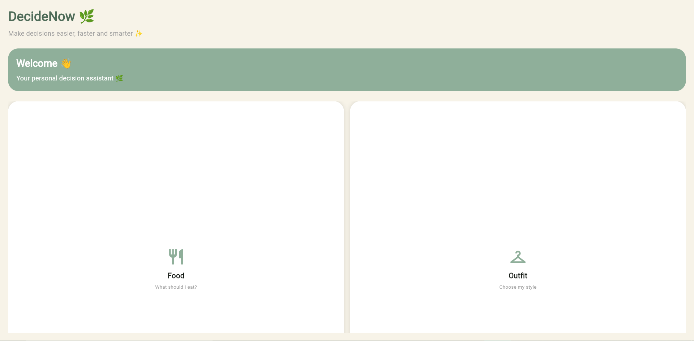
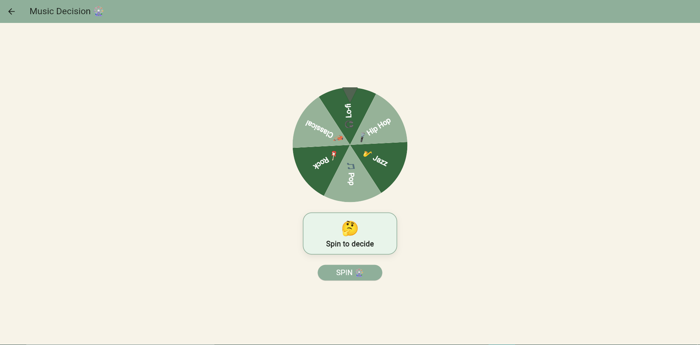
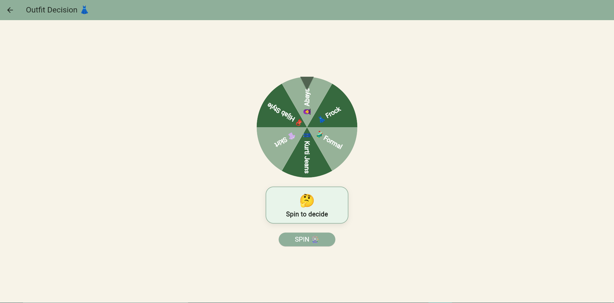
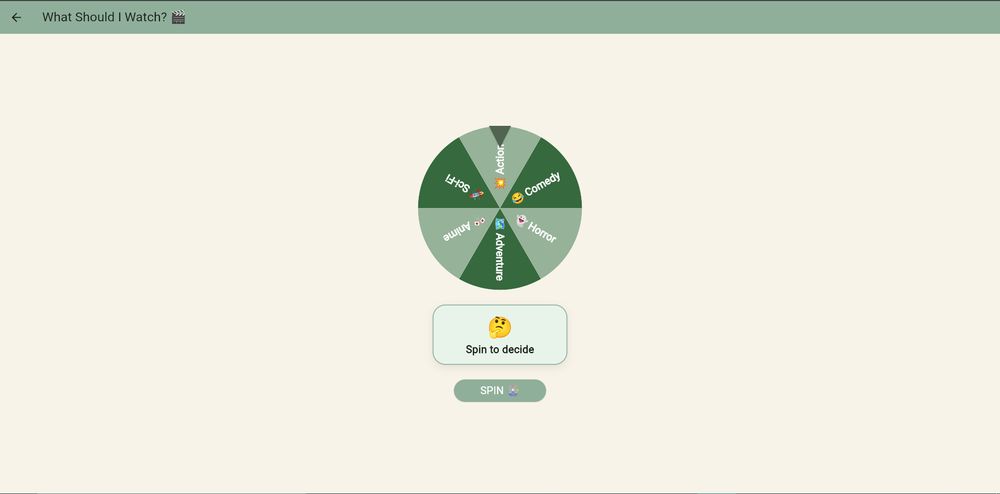
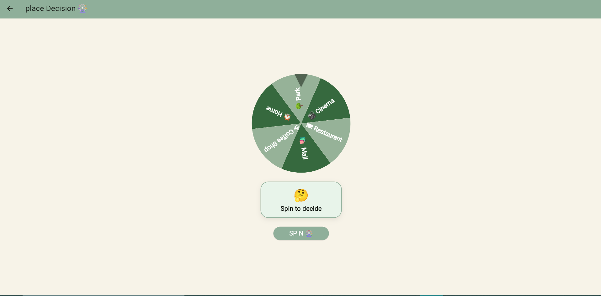
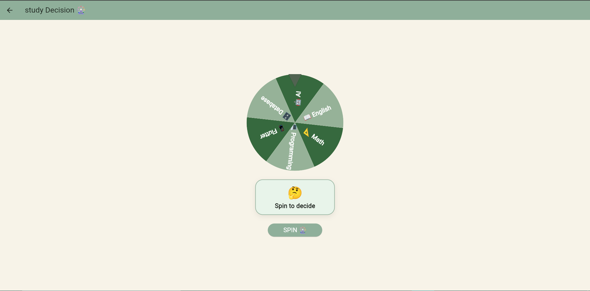

# 📱 DecideNow

A modern Flutter application that helps users make everyday decisions quickly and easily. Whether you're deciding what to eat, what to wear, what to study, which watch to buy, or where to go, DecideNow provides a simple and interactive solution.

---

## ✨ Features

- 🍔 Food Decision
- 👕 Outfit Selection
- ⌚ Watch Recommendation
- 📍 Places Suggestion
- 📚 Study Decision
- 🎨 Modern and Clean User Interface
- ⚡ Fast Performance
- 📱 Responsive Flutter Design

---

## 📸 Screenshots


| Home Screen | Food Screen |
|-------------|-------------|
|  |  |

| Outfit Screen | Watch Screen |
|----------------|--------------|
|  |  |

| Places Screen | Study Screen |
|---------------|--------------|
|  |  |

---

## 🛠️ Built With

- Flutter
- Dart
- Material Design

---

## 📂 Project Structure

```
lib/
├── main.dart
├── screens/
│   ├── home_screen.dart
│   ├── food_screen.dart
│   ├── outfit_screen.dart
│   ├── watch_screen.dart
│   ├── places_screen.dart
│   └── study_screen.dart
```

---

## 🚀 Getting Started

### Prerequisites

- Flutter SDK
- Dart SDK
- Android Studio or VS Code

### Installation

Clone the repository:

```bash
git clone https://github.com/wareeshasheraz/DecideNow.git
```

Move into the project folder:

```bash
cd DecideNow
```

Install dependencies:

```bash
flutter pub get
```

Run the application:

```bash
flutter run
```

---

## 🎯 Purpose

This application was developed as a Flutter learning project to practice mobile application development and user interface design while solving common day-to-day decision-making problems.

---

## 🔮 Future Improvements

- AI-based recommendations
- Dark Mode
- User Preferences
- Favorites Section
- Better Animations
- More Decision Categories

---

## 👩‍💻 Developer

**Wareesha Sheraz**

Software Engineering Student

GitHub: https://github.com/wareeshasheraz

---

## ⭐ Support

If you like this project, consider giving it a ⭐ on GitHub.

---

## 📄 License

This project is developed for educational purposes.
